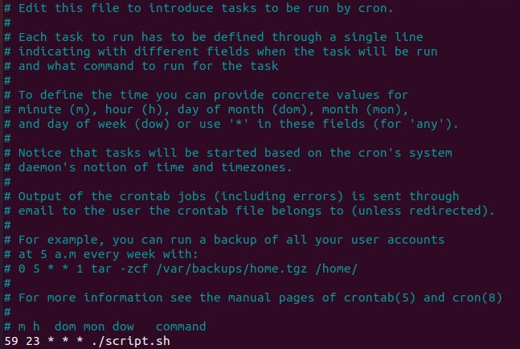

# Ejercicio 1

### 1.- Ordenamiento
``` # cut -d "-" -f 1 nginx_logs_examples.log | sort -t . -k 1,1n -k 2,2n -k 3,3n -k 4,4n | uniq -c | awk '{print $2,"=>",$1}' >  nginx_requests_total.txt ```

### 2.- Script
``` sh
#!/bin/bash
backupYear=$(date +'%Y')
backupMonth=$(date +'%m')
backupDay=$(date +'%d')
week=$(date +'%u')

mkdir -p $PWD/backup/pastor/$backupYear/$backupMonth/$backupDay && 
cp nginx_requests_total.txt $_/nginx_log_requests_$backupYear$backupMonth$backupDay.log &&
if [ $week == 7 ]
then
    i=6 &&
    while [ $i -ge 0 ]
    do
        TEMP_DATE_YEAR=$(date +'%Y' -d "-$i days")
        TEMP_DATE_MONTH=$(date +'%m' -d "-$i days")
        TEMP_DATE_DAY=$(date +'%d' -d "-$i days")

        tar -vuf $PWD/backup/pastor/$backupYear/$backupMonth/$backupDay/nginx_logs_$backupYear$backupMonth$backupDay.tar.gz -C \
        $PWD/backup/pastor/$TEMP_DATE_YEAR/$TEMP_DATE_MONTH/$TEMP_DATE_DAY .
        
        i=`expr $i - 1`
    done
fi 
```
### 3.- Crontab

``` 59 23 * * * ./script.sh ```

Se configuro en el sistema
• Para ejecutar exclusivamente de lunes a domingo
• Hora de ejecicion a las 23.59 hrs
• Todos los meses del año


